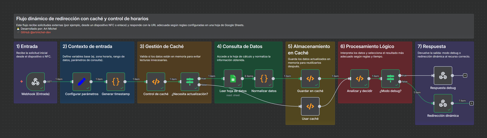

## Flujo dinámico de redirección con caché y control de horarios

Automatización en n8n para redirigir a los usuarios a distintas URLs según la fecha y hora actuales, usando Google Sheets como panel de control y una capa de caché en memoria para máximo rendimiento. Ideal para QR/NFC, campañas y eventos que cambian en el tiempo.

### ¿Qué hace este flujo?
- **Redirecciona dinámicamente según fecha y hora**: evalúa ventanas de tiempo de inicio/fin por cada URL.
- **Usa Google Sheets como panel de control**: edita el “dashboard” sin tocar código.
- **Maneja caché en memoria**: reduce llamadas a Sheets con TTL para acelerar respuestas.
- **Devuelve redirecciones seguras y escalables**: responde con 302 y cabeceras no-cache.

### Características principales
- **Gestión de caché con TTL**: mantiene en memoria los datos durante 60 s; incluye fallback de 1 h.
- **URLs agendadas**: cada fila define tipo y rango horario (inicio/fin) con precisión de minutos.
- **Redirección por defecto**: si no hay coincidencias activas, usa la URL marcada como `default`.
- **Modo debug**: vista legible del razonamiento y de la URL seleccionada.
- **Configurable por Google Sheets**: cambia contenidos sin desplegar ni editar n8n.

### Requisitos
- **n8n** funcionando (self-hosted o nube) con acceso público al Webhook.
- **Google Sheets** con credenciales de **Service Account** (la hoja compartida con el email del servicio).

## Cómo usar el flujo

### 1) Importar el flujo a n8n
1. Abre n8n → Import/Export → Import.
2. Selecciona el archivo `NFC dinámico.json` de este repositorio.

### 2) Configurar credenciales de Google Sheets
1. Crea una credencial de tipo Service Account en n8n.
2. Comparte tu hoja de Google con el email de la cuenta de servicio.
3. En el nodo `Leer hoja de datos`, selecciona tu credencial y verifica `documentId` y `sheetName`.

### 3) Preparar la hoja de cálculo (dashboard)
- Crea una pestaña (por ejemplo, `dashboard`) con las columnas, en este orden:
  - `tipo`, `fecha_inicio`, `hora_inicio`, `fecha_fin`, `hora_fin`, `url`, `description`

Ejemplo (CSV):
```csv
tipo,fecha_inicio,hora_inicio,fecha_fin,hora_fin,url,description
default,,,,,https://platzi.com/,Default URL Link principal, sin fecha ni hora, siempre visible si no hay otro activo.
dynamics,2025-09-04,00:00,2025-04-30,24:00,https://platzi.com/cursos/concurso-n8n/concurso-de-licencias-n8n-en-platzi-como/,Dynamic URL Link temporal con inicio y fin
specific,2025-04-20,03:00,2025-04-25,14:00,https://platzi.com/cursos/concurso-n8n/terminos-y-condiciones/,Specific URL Link recurrente por día/hora fija
```

Notas importantes:
- Formatos esperados: `fecha` en `YYYY-MM-DD` y `hora` en `HH:mm` (24h).
- Tipos válidos: `default`, `specific`, `dynamics`.
- Prioridad: `specific` → `dynamics` → `default`.
- Zona horaria interna: America/Denver (El Paso). Ajusta si tu caso de uso lo requiere.

### 4) Publicar el endpoint (Webhook)
- El nodo `Webhook (Entrada)` genera una ruta tipo: `/webhook/<ID>` en tu n8n.
- Puedes exponer un slug amigable (p. ej., `/tap`) con tu proxy o servidor web.

Ejemplo con `.htaccess` (Apache) para slug amigables:
```apache
<IfModule mod_rewrite.c>
  RewriteEngine On

  # Redirección principal: /tap → Webhook de n8n
  RewriteRule ^tap(.*)$ https://n8n.example.com/webhook/<ID_WEBHOOK> [R=302,L]

  # Modo debug: /tap-debug → agrega ?debug=1
  RewriteCond %{REQUEST_URI} ^/tap-debug
  RewriteRule ^tap-debug(.*)$ https://n8n.example.com/webhook/<ID_WEBHOOK>?debug=1 [R=302,L]
</IfModule>
```

### 5) Probar
- Redirección normal (302):
```bash
curl -i -L https://tudominio.com/tap
```

- Modo debug (cabeceras `no-cache`, texto plano):
```bash
curl -i https://tudominio.com/tap?debug=1

# O, si configuraste /tap-debug en tu proxy/Apache:
curl -i https://tudominio.com/tap-debug
```

## Casos de uso sugeridos
- **Iglesias, conferencias, educación**: horarios y contenidos que cambian por sesión.
- **Eventos con registros dinámicos**: formularios de registro activos solo durante la ventana del evento.
- **Marketing con QR/NFC**: reutiliza el mismo código/enlace y cambia destino por campaña.

## Detalles técnicos
- **Caché**: TTL 60 s y fallback de 1 h en memoria del workflow (datos normalizados). Reduce lecturas a Sheets.
- **Selección de URL**:
  - `specific` y `dynamics` guardan ventanas de tiempo (inicio/fin). Si la hora actual cae dentro de una ventana, se elige esa URL.
  - Si hay múltiples, `specific` tiene prioridad.
  - Si no hay coincidencias, se usa la de `default`.
- **Seguridad y rendimiento**:
  - Respuesta 302 con cabeceras: `Cache-Control: no-store, no-cache, must-revalidate, max-age=0`, `Pragma: no-cache`, `Expires: 0`, `Surrogate-Control: no-store`.
  - El modo debug responde texto plano para validar reglas sin redirigir.

## Estructura del repositorio
- `NFC dinámico.json`: definición del flujo de n8n.
- `dashboard.csv`: ejemplo de datos para la hoja de cálculo.
- `.htaccess`: ejemplo de reglas para exponer slugs amigables hacia n8n.

## Licencia y autoría
- **Licencia**: MIT
- **Autor**: Art Michel – `@artmichel-dev`


